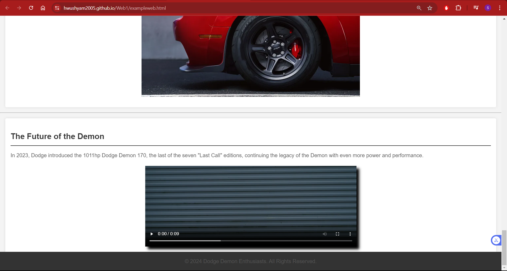
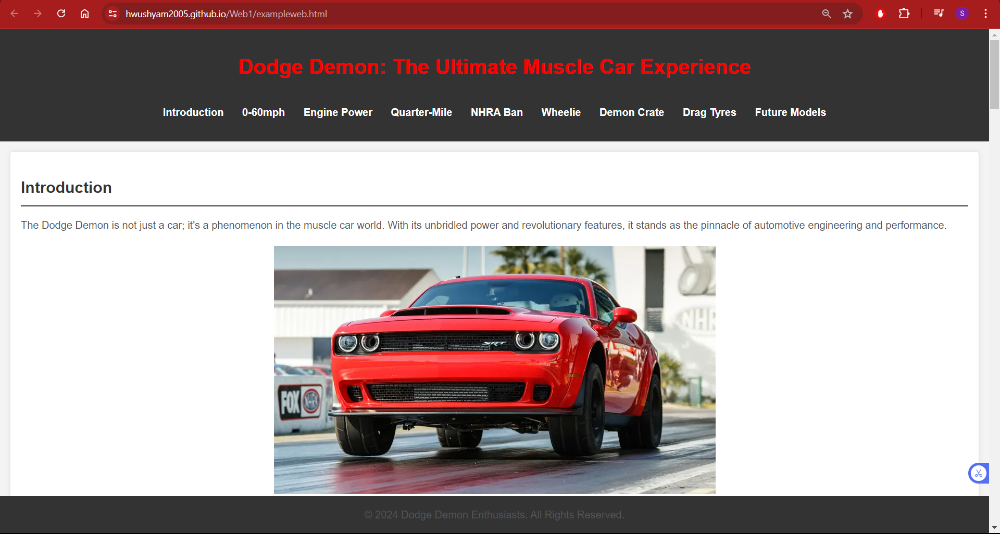

# Web1
Simple Website 1

Link: https://hwushyam2005.github.io/Web1/exampleweb.html
 
 
The webpage consist of several subparts in the navigation bar that works in way that when we click it goes to that section.
 
 
These are the sections below: 
 
-> Introduction 
 
-> 0-60mph 
 
-> Engine Power
 
-> Quarter-Mile
 
-> NHRA Ban
 
-> Wheelie
 
-> Demon Crate
 
-> Drag Tyres
 
-> Future Models
 
 
below are few screen shots of how the webpage looks like
 
 
-> In this screen shot, i have added a video in this website which works manually in a way that when we click on play button in bottom left side.

 
 
->This screenshot is where we can access the 0-60mph section which either we can scroll down or click on the 0-60mph in the navigation part.

 
 
->This is the screen shot of the working navigation bar. 

